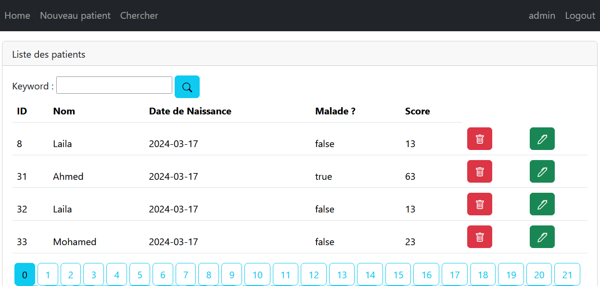

# 🏥 Patient Management Web Application 🩺

## Introduction
This repository contains the source code for a Java EE web application built using Spring MVC, Thymeleaf, and Spring Data JPA. The purpose of this application is to manage patients' records efficiently. The application offers various functionalities to handle patient data effectively.

## Features 🚀
The application offers the following features :

1. **Display Patients**: View the list of patients.
2. **Pagination**: Navigate through the patient list with pagination support.
3. **Search Patients**: Search for specific patients.
4. **Delete Patient**: Remove a patient from the records.
5. **Template Page**: a template page for consistent UI elements.
6. **Form Validation**: to ensure data integrity.
7. **InMemory Authentication**: Implement authentication using in-memory storage.

## Getting Started 🚀
To get started with the application, follow these steps:

1. **Clone the Repository**: Clone this repository to your local machine.

2. **Set Up Environment**: Ensure you have Java, Maven, and a compatible IDE installed on your system.

3. **Run the Application**: Build and run the application using Maven or your IDE.

4. **Access the Application**: Once the application is running, access it via the provided URL in your web browser (check the application properties file).

## Usage 🛠️
1. **View Patients**: Navigate to the Patients section to view the list of patients.
2. **Pagination**: Use pagination controls to navigate through multiple pages of patient records.
3. **Search Patients**: Utilize the search functionality to find specific patients by name or ID.
4. **Add, update and delete Patients**: For admins only.
5. **Form Validation**: Ensure all form inputs are validated before submission to maintain data integrity.
6. **Authentication**: Login to access the application functionalities.

## Acknowledgements 🙏
Special thanks to Mr. Mohamed YOUSSFI for walking us through the steps to create this project.
